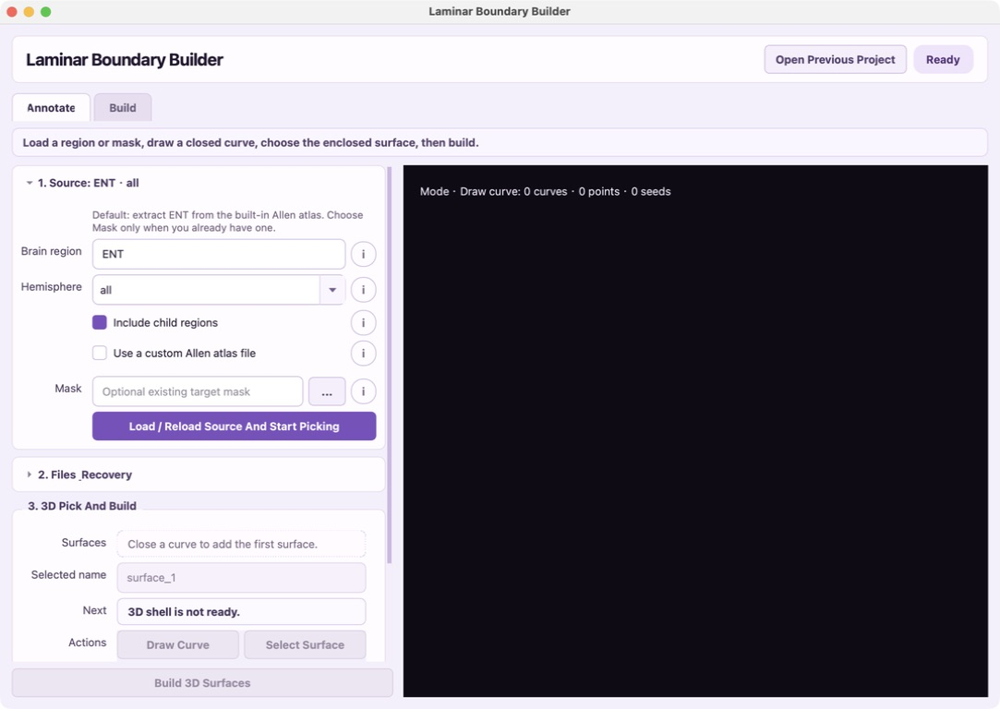
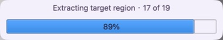
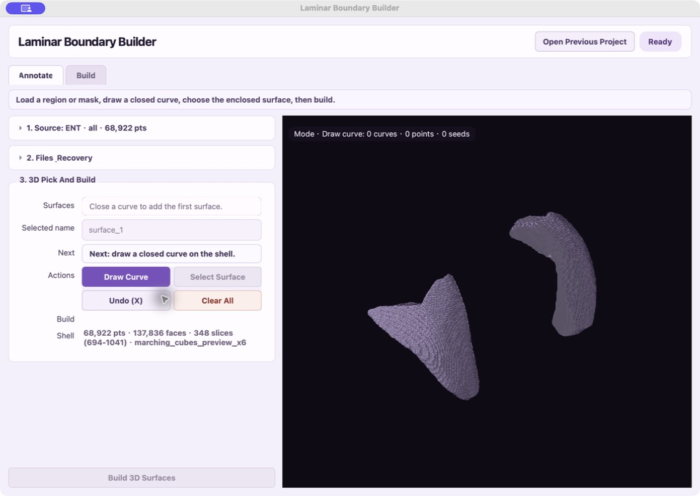
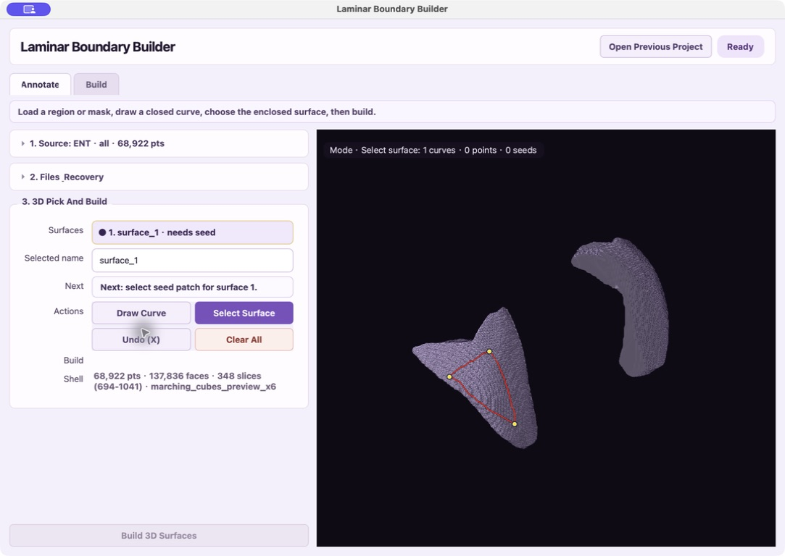
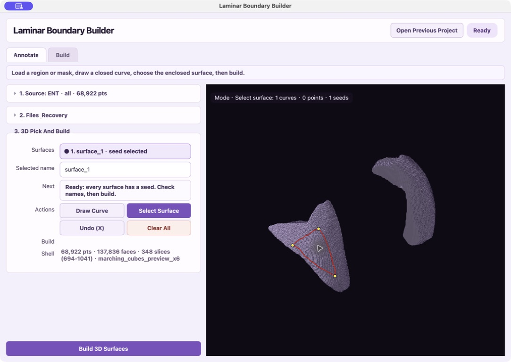
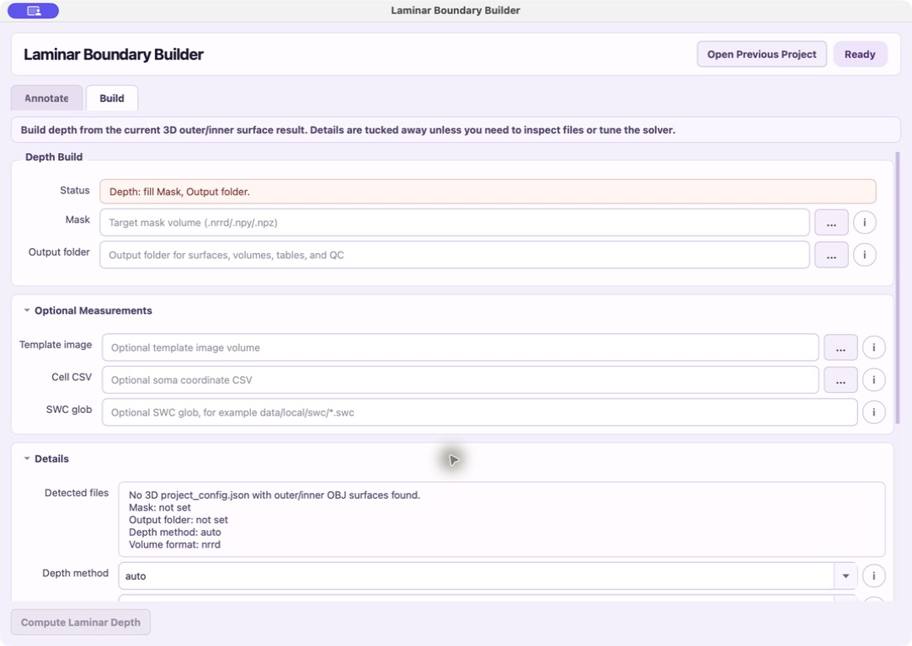
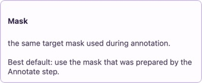

# Laminar Boundary Builder

这是一个用于构建脑区层状边界的 macOS 桌面工具。它把一条原本分散的流程收进同一个界面：加载脑区或 mask，在 3D shell 上画边界、选择目标表面，再计算 laminar depth、layer normal 和 QC 结果。GUI 可以直接双击使用，同时保留命令行入口。

[下载最新 macOS DMG](https://github.com/cerebrocss/laminar-boundary-builder/releases/latest)

## 文件结构

```text
apps/laminar_boundary_builder/
├── laminar_boundary_builder/
│   ├── core.py      # 3D shell、surface patch、depth、QC 共享算法
│   ├── cli.py       # depth/selfcheck 命令行入口
│   ├── app.py       # PyQt 桌面 GUI
│   ├── __main__.py  # python -m laminar_boundary_builder
│   └── __init__.py
├── run.py           # 不安装时也能直接运行
├── launch_gui.py    # GUI 打包入口
├── pyproject.toml   # 后续 pip 安装和打包用
├── requirements.txt
└── build_macos.sh   # PyInstaller 打包起点
```

## 本地打开 GUI

克隆本仓库并安装依赖后，在仓库根目录运行：

```bash
python launch_gui.py
```

GUI 主界面有两个正式页面：

- `Annotate`：在 3D shell 上画闭合曲线、选择 seed patch、构建 surface OBJ
- `Build`：从 3D build 输出的 outer/inner OBJ 计算 laminar depth、layer normal、表格和 QC

旧的 2D 切片端点重建流程已经移除。不要再用切片 CSV 或 `boundary_annotations.json` 作为 surface build 输入。

## 五分钟图文演示

整条流程为：**加载脑区 → 画闭合曲线 → 选择曲线围住的表面 → 构建 3D surface → 计算层深度。**

### 1. 加载脑区或已有 mask

默认会从内置 Allen atlas 提取 `ENT`。也可以改成其他脑区 acronym，或直接选择已有的 `.nrrd/.npy/.npz` mask。填好后点 `Load / Reload Source And Start Picking`。



加载时会显示真实进度，不需要靠猜测判断软件是否还在工作：



### 2. 在 3D shell 上画闭合曲线

shell 出现后，紫色按钮表示当前模式。保持 `Draw Curve` 为紫色，在目标边界上依次点选；已有点可以拖动微调。至少三个点后，点 `Close Current Curve` 闭合曲线。



### 3. 选择曲线围住的目标表面

闭合后软件会切换到 `Select Surface`。在曲线围住的目标一侧点一下，告诉软件要保留哪块表面。左侧 `Next` 会一直提示当前真正需要做的下一步。



### 4. 命名并构建 3D surfaces

把队列项命名为 `outer` 或 `inner`。曲线和 seed patch 都齐全后，底部常驻的 `Build 3D Surfaces` 会变成可用状态；滚动左侧参数时也不会找不到它。



如果需要 outer 和 inner，就重复“画曲线 → 选表面”各做一次，再统一构建。输出会保存 surface OBJ、项目配置和可再次编辑的 3D 标注 JSON。

### 5. 计算 laminar depth

切换到 `Build` 页，填写 mask 和输出目录。普通情况下只需要最上方两个必填项；细胞坐标、SWC、算法细节都收在可展开区域里。底部的 `Compute Laminar Depth` 始终可见。



每个 `i` 按钮只保留“这个参数做什么”和“通常该怎么选”，需要时点开，不占用主流程空间：



## 3D 图上交互标注

推荐现在用这个流程：

1. 打开 `Annotate` 页。
2. 默认 `Brain region` 会填入：

```text
ENT
```

点 `Load / Reload Source And Start Picking` 时，软件会从全脑 Allen `annotation_10.nrrd` 里提取 ENT mask，并先保存成临时 `.npy` 缓存文件。这个临时 mask 会在 app 关闭时自动清理，不会变成长期数据。

如果想换别的脑区，直接把 `Brain region` 改成对应 acronym 或 ID，例如：

```text
VISp
```

默认会把子脑区一起提取；`Hemisphere` 可以选 `all` / `left` / `right`。软件会把这个 mask 放进临时目录，关闭软件时自动删除。

如果想长期保存当前提取出来的 mask，加载后点 `Export Current Mask`，手动导出到项目目录。只有这一步会把临时 mask 变成你自己管理的永久文件。

如果源码运行时没有内置 atlas，或者要换成别的 annotation atlas，勾选 `Use a custom Allen atlas file`，再选择 `.nrrd/.pkl` 文件。本机打包版可以带上 `annotation_10.nrrd`；公开源码仓库不包含 atlas 大文件，其他人也可以加载现成 mask，或在本地提供自己的 Allen annotation atlas。

3. `Template image` 可以选择：

```text
data/local/misc/average_template_10.nrrd
```

4. 点 `Load / Reload Source And Start Picking`，等待提取进度窗口结束后开始标点。

如果已经有其他现成 mask，直接在 `Mask` 里选择；只要 `Mask` 里有非临时路径，软件会优先使用这个现成 mask，例如：

```text
data/local/laminar_boundary_masks/ENT_left_ml_low_10um_mask.nrrd
```

5. `Output folder` 选择一个标注输出目录。
6. 左侧 `Shell` 会显示当前 3D shell 的点数、面片数和 mask 有效切片范围。
7. 在 3D 视图里直接点 shell 表面，点会连成沿三角网格走的曲线。拖动已有点可以局部微调。
8. 闭合曲线后，这条曲线会进入 surface 队列。选中队列里的 surface，给它命名，例如：

```text
outer
inner
```

9. 点 `Select Surface`，在闭合曲线限定的区域里点 seed patch。seed patch 就是告诉软件“我要这条曲线围住的哪一块表面”。

10. 点 `Build 3D Surfaces`。软件会在输出目录下写入：

```text
build_3d/project_config.json
build_3d/surfaces/*.obj
build_3d/surface_3d_annotations_*.json
```

`surface_3d_annotations_*.json` 是可编辑的 3D 标注线和 seed patch。之后要微调，就重新加载同一个 mask，再加载这个 JSON。

常用快捷键：

```text
X      撤销上一步 3D 标注
Enter  当前 surface 队列满足条件时直接 build
Esc    退出点选模式，重新编辑输入来源
```

多个 surface 的命名逻辑：每条闭合曲线会新增一个 surface 队列项。队列里的每一项都有自己的名字和 seed patch。比如先画 outer，命名为 `outer`；再画 inner，命名为 `inner`。

## 本地直接运行

在仓库根目录可以跑轻量冒烟检查：

```bash
python run.py selfcheck
```

## 安装成命令

进入这个文件夹：

```bash
cd apps/laminar_boundary_builder
python -m pip install -e .
```

安装后可以直接运行：

```bash
laminar-boundary-builder depth \
  --mask data/local/ENT_mask.nrrd \
  --project-config results/laminar_boundary/ENT_left/build_3d/project_config.json \
  --output-dir results/laminar_boundary/ENT_left/depth
```

## 正式数据流程

推荐走图上交互流程：

```text
Annotate 里加载 mask
        ↓
在 3D shell 上画 outer/inner 闭合曲线，并各自选择 seed patch
        ↓
Build 3D Surfaces
        ↓
得到 build_3d/project_config.json 和 surface OBJ
        ↓
Build 页或 CLI depth 从 project_config.json 计算 laminar depth
```

## 输出

3D surface build 主要输出在 `build_3d/` 下：

- `project_config.json`
- `surfaces/*outer*.obj`
- `surfaces/*inner*.obj`
- `surface_3d_annotations_*.json`

Depth build 主要输出在 depth 输出目录下：

- `volumes/laminar_depth.nrrd`
- `volumes/boundary_labels.nrrd`
- `volumes/layer_normal_x.nrrd`
- `volumes/layer_normal_y.nrrd`
- `volumes/layer_normal_z.nrrd`
- `tables/cell_laminar_depth.csv`
- `tables/dendrite_laminar_depth.csv`
- `qc/qc_slice_overlay/`

体积文件默认写成 NRRD。如果要输出 NIfTI，先安装：

```bash
python -m pip install ".[nifti]"
```

然后运行时加：

```bash
--volume-format nii.gz
```

## macOS 打包

运行：

```bash
bash build_macos.sh
```

成功后会得到：

```text
dist/Laminar Boundary Builder.app
dist/Laminar Boundary Builder.dmg
```

双击 `.app` 就会打开窗口。正式发给其他电脑前，后续还可以补 Developer ID 签名和 Apple notarization。

后面如果继续做 3D 标注编辑器，建议继续放在这个目录里，并复用 `laminar_boundary_builder/core.py`，不要再把算法散回主仓库。

## License

MIT License. See `LICENSE`.
